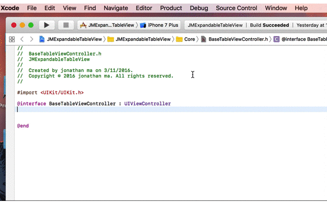

## QuickXcoder
An Xcode source editor extension to save Xcoders' time.

## Feature

#### 1. Objective-C Property Place Holder

I have been tired of typing workds like ```@property (nonatomic, strong)``` when declaring a property in Objective-C. With QuickXcoder extension installed, I don't have to do that any more.



## How to Install
1. Archive and export a package.
2. Run the exported ```QuickXcoder```. (Ignore the crash.)
3. Enable the extension in ```System Preferences -> Extensions -> Xcode Source Editor```.
4. Launch Xcode, the extension will be found in ```Editor``` menu.
5. If needed, set key bindings in ```Xcode->Preferences->Key Bindings``` by searching ```Property Place Holder```.

Tiny feature saves us time.

